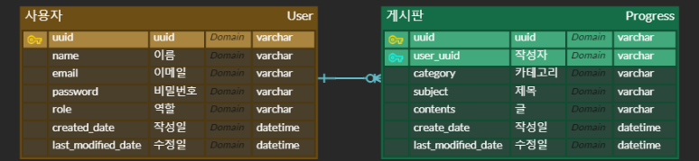

# 원티드 백엔드 프리온보딩 인턴쉽 사전과제
> 개발 내역에 대한 요약  
> + 기본 개발과제 1~7  
> + 단위/통합 테스트 코드 작성  
> + AWS EC2 배포 (Github Action, AWS CodeDeploy, S3, EC2)

<br>

### ✔️️️ 지원자의 성명
##### 양일표

<br>

### ✔️️️ 애플리케이션의 실행 방법 (엔드포인트 호출 방법 포함)
##### AWS EC2 인스턴스를 이용한 접근
+ ```http://13.209.104.109:8080/{api}```
  + ex) ```http://13.209.104.109:8080/api/user/register``` 와 같이 접근 가능합니다.
+ 저는 테스트를 위해 **postman**을 사용했습니다. (시연영상 참조)

<br>

### ✔️️ 데이터베이스 테이블 구조
+ 데이터베이스는 크게 **USER**, **BOARD** 테이블로 구성되어 있으며 세부 항목은 다음과 같습니다.



<br>

### ✔️ 구현한 API의 동작을 촬영한 데모 영상 링크
+ [Postman 이용한 AWS 사용 시연영상](https://youtu.be/NPi2DFE2PtI)

<br>

### ✔️️ 구현 방법 및 이유에 대한 간략한 설명


+ 가장 익숙하고 빠르게 작성할 수 있는 언어인 Java와 Spring을 사용했습니다.
+ 배포는 무중단 배포 적용을 위해 CI/CD 툴로 Github Action을 사용하였고, AWS CodeDeploy, S3, EC2를 사용했습니다.
  + 이미 버전관리를 Github으로 하고 있었고, Travis 보다 세팅이 간편하고 빌드 속도가 빨라 적용하게 되었습니다.
  + 그리고 무중단 배포 환경이지만 CI, CD 중간로직을 변경하므로서 상황에 따라 조작이 간편한 AWS CodeDeploy, S3를 사용하게 되었습니다. AWS Elastic Beanstalk도 고려했지만 커즈텀하기에 더 좋은 툴로 선택했습니다.
  + [배포과정 history](https://ilpyo-yang.github.io/devops/2023/05/08/AWS.html#aws-다양한-배포-방법들)
  
<br>

### ✔️️ API 명세(request/response 포함) [URL](https://ilpyo.notion.site/API-d989a5067e384350ae50c3022a503eec?pvs=4)
